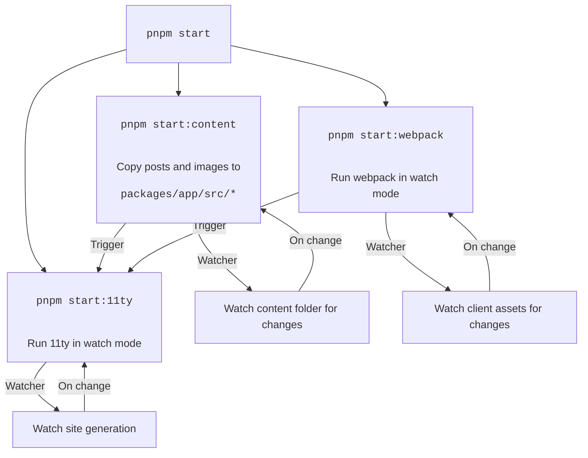

# amorgunov.com

[](https://app.netlify.com/sites/nukeapp/deploys) 

Hey! Here you can find source files for my personal blog built with [**_11ty_**](https://www.11ty.io/), [**_webpack_**](https://webpack.js.org/) and hosted by [**_Netlify_**](https://netlify.com/). You can see all pages on [https://amorgunov.com](https://amorgunov.com)

## Monorepo packages

| package                         | description |
| --------                        | :------- |
| [app](./packages/app/) 	        | 11ty application |
| [content](./packages/content/) 	| Blog content (posts and images)	|
| [scripts](./packages/scripts/) 	| Addition scripts to generate post template,<br/> optimize images and update reactions in posts 	|

## How it works



## Development

Install [`pnpm`](https://pnpm.io/installation) (or change scripts into `package.json` files to your package manager).

```bash
nvm use

pnpm install

# Generate templates for 11ty app
pnpm run --filter @amorgunov/app build:webpack

# Start webpack and 11ty watchers
pnpm start
```

## Troubleshoots

- Add dark theme to `manifest.json` when it will be supported (see https://github.com/w3c/manifest/issues/975)

## License

Licensed under the MIT license.
