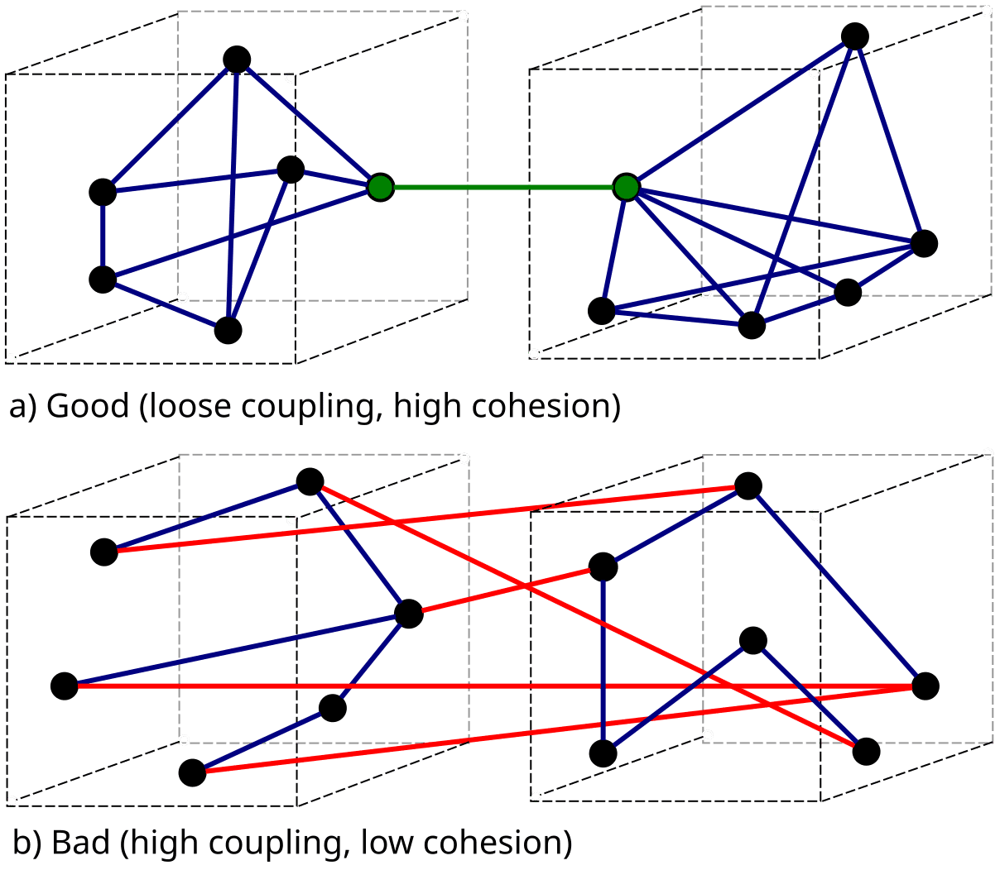
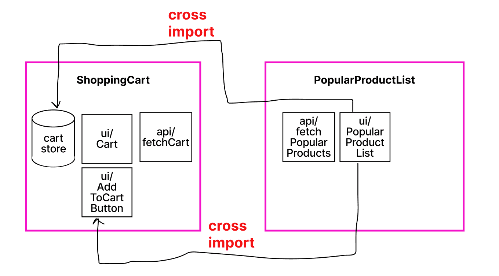
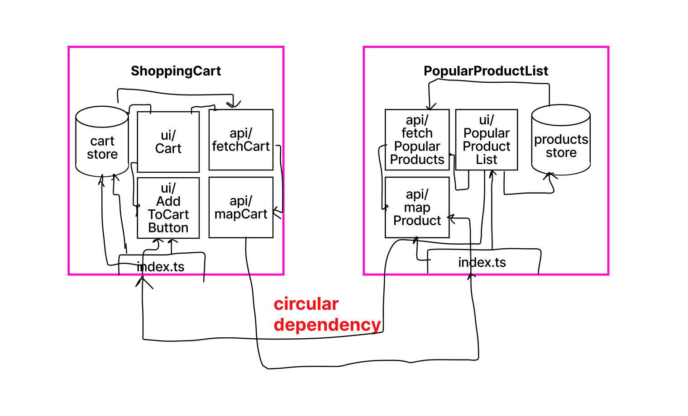
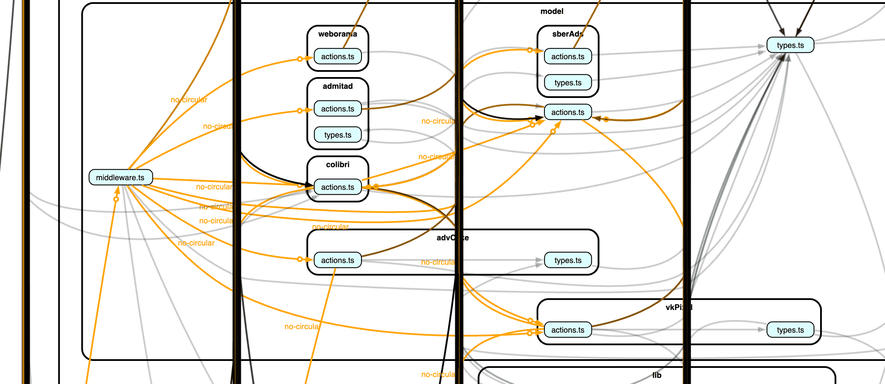
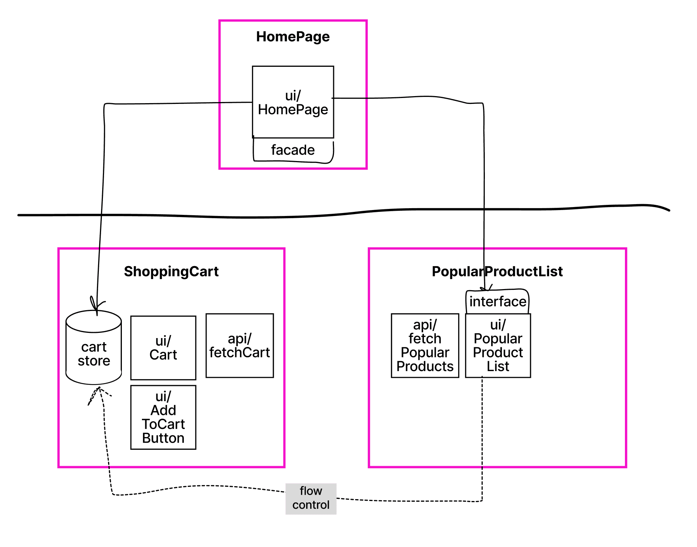
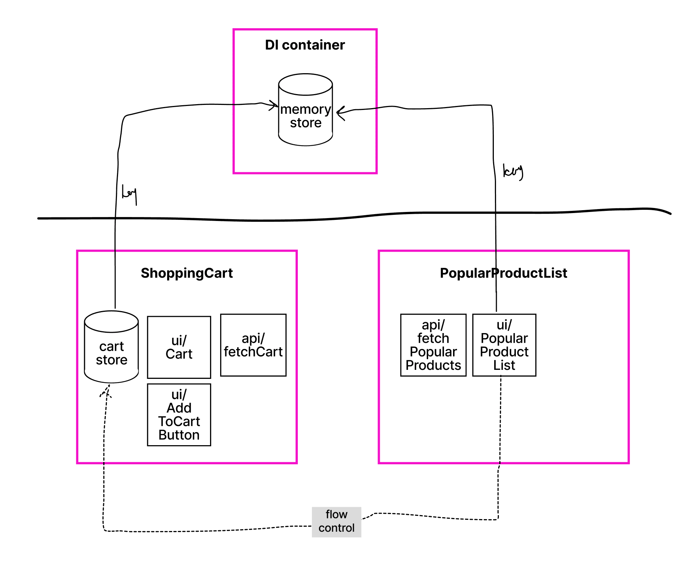
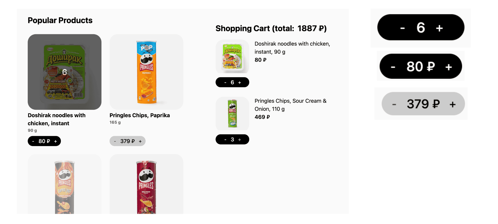
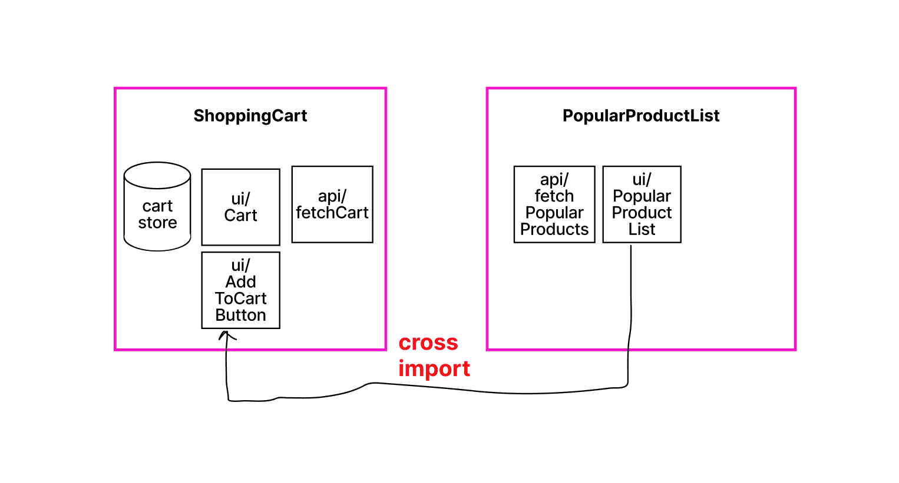
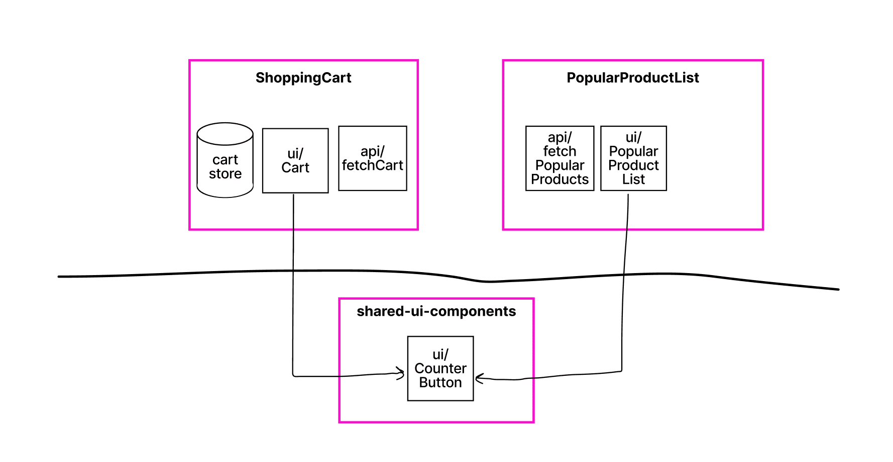
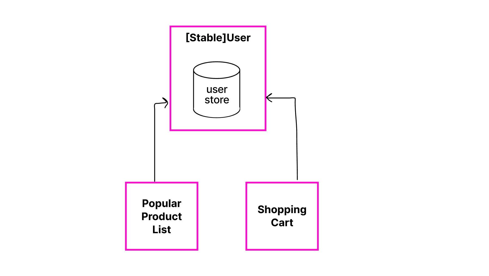

Друзья, всем привет! Ровно два года без постов в блоге — пора исправляться. Сегодня поговорим про то, что такое кросс-импорты модулей, почему они плохи (или нет) в контексте архитектуры приложения и как их можно решать. Если вам интересно почитать про то, почему кросс-импорты могут навредить, то можете сразу перейти к разделу [«Плохи ли кросс-импорты»](#плохи-ли-кросс-импорты).

Вообще, понятие кросс-импортов идет [из архитектурной методологии Feature-Sliced Design](https://feature-sliced.github.io/documentation/docs) (_FSD_), но оно применимо и за пределами методологии, поэтому мы будем рассматривать его без привязки к _FSD_ (хотя примеры из методологии, конечно же, будут).

## Модульная архитектура

Сначала разберёмся, а что такое вообще модуль и модульная архитектура, прежде чем обсуждать кросс-импорты модулей. Посмотрим на определение:

> Модуль — это логически связанная часть кода, которая инкапсулирует определённую функциональность и может быть переиспользована или независимо изменена.

Модули используются в модульной архитектуре, которую мы повсеместно применяем в наших проектах. Это стиль проектирования, в рамках которого мы строим наше приложение на основе вот таких **независимых** модулей. Главное тут слово — независимых: модули должны обладать низкой связанностью. Под связанностью (_coupling_) понимается количество связей между двумя или более модулями. Чем меньше число — тем ниже связанность.

Я думаю, вы слышали такие понятия, как _low coupling_ (низкая связанность) и _high cohesion_ (высокое зацепление). Высокое зацепление означает сохранение частей кодовой базы, которые связаны друг с другом, в одном месте. Низкая связанность, в то же время, заключается в максимальном разделении не связанных между собой частей кодовой базы.



Если модули будут как можно более изолированными и самодостаточными, а также независимыми, мы получим возможность независимо их развивать (рефакторить, обновлять, тестировать).

Общая рекомендация проста: **постарайтесь придерживаться принципа «высокого зацепления и низкой связанности» на всех уровнях вашей кодовой базы**. Подробнее можете почитать в материале от Владимира Хорикова [про различие между cohesion и coupling (en)](https://enterprisecraftsmanship.com/posts/cohesion-coupling-difference/).

Что мы имеем по итогу:

- (1) Архитектура строится на основе модулей.
- (2) Модули должны обладать низкой связанностью (_знание про высокое зацепление сейчас нам не так интересно в рамках текущей темы_).

## Кросс-импорты модулей

Теперь поговорим про кросс-импорты модулей. Это ситуация, когда модуль на одном слое <sup><a id="sup-1" href="#sup-1-target">[1]</a></sup> напрямую зависит от другого модуля.

Примеры рассмотрим  [на демо приложении](https://github.com/noveogroup-amorgunov/codefest15-demo-app), которое я приготовил для доклада на конференцию CodeFest. У нас есть модули покупательской корзины и списка с продуктами, которые имеют связи друг с другом:



К чему такая связь приводит? Во-первых, к более высокой связанности между модулями, что усложняет нашу архитектуру.

Во-вторых, это может привести к циклическим зависимостям модулей. Особенно часто это возникает, если мы используем публичное API для модулей в виде `index.ts` файлов.



Циклические зависимости нарушают [принцип ацикличных зависимостей (_ADP_)](https://en.wikipedia.org/wiki/Acyclic_dependencies_principle), который говорит о том, что граф зависимостей пакетов или компонентов не должен иметь циклов (принцип ввёл Роберт Мартин). А нарушение _ADP_ в свою очередь, может приводить к циклическим зависимостям на уровне файлов. _JavaScript_ сейчас достаточно терпим к таким зависимостям, но в любой момент вы сможете получить ошибку [_Cannot access 'X' before initialization_](https://developer.mozilla.org/en-US/docs/Web/JavaScript/Reference/Errors/Cant_access_lexical_declaration_before_init), которая может полностью сломать ваше приложение.

Например, в рамках одного моего проекта было огромное число циклических зависимостей, которые сборщик обычно обходил, но периодически он не справлялся — фиксы были совсем нетривиальны:



_Эта часть графа построена через инструмент [dependency-cruiser](https://www.npmjs.com/package/dependency-cruiser), который визуализирует связи модулей в проекте._

## Как решать кросс-импорты

Для решения кросс-импортов существует два основных подхода: инверсия зависимостей и вынос общей логики в отдельный модуль. Далее рассмотрим каждый из них.

### Dependency inversion

Принцип инверсии зависимостей (англ. _dependency inversion principle_, _DIP_) достаточно популярен и входит в пятёрку принципов _SOLID_. Он гласит, что модули должны зависеть от абстракций, а не от конкретных деталей реализации. Другими словами, если есть прямая зависимость одного модуля от другого, то её можно развернуть через введение абстракции (в мире фронтенда — через _TypeScript_-интерфейс).

Более подробно можете послушать [в ролике Евгения Паромова](https://www.youtube.com/watch?v=9gOrAh7H88o), где Женя показывает множество примеров из мира реакта. Или же — более общее [видео от Айти Синяка](https://www.youtube.com/watch?v=wjQ9pmgwyIc).

В нашем примере выше UI-компонент модуля `PopularProductList` ходит напрямую в стор модуля `ShoppingCart`.


```tsx
import { cartStore } from '~/widgets/cart'

export function ProductList() {
  const cartItems = cartStore.getItems()

  // ...
}
```

Для того чтобы развернуть зависимость, нужно описать интерфейс реализации, которую мы ожидаем получить. Это можно сделать через пропсы React-компонента.

```tsx
type Props = {
  cartItems: Product[]
  ^^^^^^^^^^^^^^^^^^^^
  указываем интерфейс зависимости
}

export function ProductList(props: Props) {
  const cartItems = props.cartItems

  // ...
}
```

И далее внедрить зависимость через верхнеуровневый <sup><a id="sup-2" href="#sup-2-target">[2]</a></sup> компонент:

```tsx
// ~/page/home/ui/HomePage.ts

import { cartStore } from '~/widgets/cart'

export function HomePage() {
  const cartItems = cartStore.getItems()

  return (
    <ProductList cartItems={cartItems} />
                 ^^^^^^^^^^^^^^^^^^^^^
                 внедряем зависимость
  )
}
```

Получаем следующую схему:



Поток управления остается прежним: `ProductList` внутри себя использует стор из модуля `ShoppingCart`, но направление зависимости инвертировалось, и теперь `ProductList` зависит не от реализации, а от абстракции (_TypeScript_-интерфейс пропсов компонента). Сама зависимость внедряется через модуль из слоя выше (страница `HomePage`).

<hr class="apple-divider" />

Также довольно часто используют DI-контейнер для того, чтобы внедрять зависимости на уровне всего проекта. Из-за того, что в _TypeScript_ интерфейсы доступны только на момент компиляции, DI-контейнеры реализуют на токенах (хотя есть реализации и на интерфейсах, типа [wessberg/di](https://github.com/wessberg/di), но в нём используется отдельный компилятор).

```ts
// ~/app/providers/diContainer

export const container = new Container({
  FEATURE_FLAGS_SERVICE_TOKEN: featureFlagService,
  THEME_SERVICE_TOKEN: themeService,
  CART_STORE_TOKEN: cartStore,
  ^^^^^^^^^^^^^^^^^^^^^^^^^^^
  регистрируем зависимость по токену CART_STORE_TOKEN
  // ...
} as const)
```

```tsx
export function ProductList(props: Props) {
  const cartStore = useDi('CART_STORE_TOKEN')
  const cartItems = props.cartItems

  // ...
}
```

В мире _React_ вместо DI-контейнера часто используют встроенный механизм внедрения зависимостей на основе контекста:

```tsx
export function ProductList(props: Props) {
  const cartStore = useContext(CartStoreContext)
  const user = useContext(UserStoreContext)
  // ...
}
```

Схематично данный подход можно представить следующим образом:



Здесь оба модуля используют зависимость от DI-контейнера, но прямая связь между ними отсутствует. Именно то, чего мы и добивались. [Пример в репозитории](https://github.com/noveogroup-amorgunov/codefest15-demo-app/blob/main/packages/modular-architecture-fsd/src/widgets/popular-products/ui/ProductList/ProductList.tsx#L18).

> НО, никогда не стоит забывать, что **⚠️ не все зависимости стоят того, чтобы их инвертировать**. Подробнее эту мысль раскрыл далее — в разделе [«Плохи ли кросс-импорты»](#плохи-ли-кросс-импорты).

### New package

Другой приём, как можно избежать кросс-импортов, — это вынести общий функционал в отдельный компонент. Мы, разработчики, повсеместно используем этот подход при разработке интерфейсов, потому что он достаточно интуитивен.

Вернёмся к нашему примеру. В обоих модулях используется кнопка добавления товара в корзину (она немного различается в зависимости от места использования — где-то отображается цена, где-то количество добавленных элементов в корзину). Где её разместить? В каком из модулей?



Всё же она больше про корзину —  давайте разместим её там. Но на выходе получаем, о неожиданность, кросс-импорт.



Первое, что можно сделать (и мы это уже умеем) – это использовать принцип инверсии зависимостей и прокинуть компонент-кнопку через пропсы (используя механизм _render_ -слотов):

```tsx
type Props = {
  cardActionSlot: ReactNode
  ^^^^^^^^^^^^^^^^^^^^^^^^^
  абстракция для действий,
  отображаемых на карточке товара
}

export function ProductList(props: Props) {
  /* ... */

  return (
    <div>
      {products.map(product => (
        <div key={product.id}>
          {product.name}
          {props.cardActionSlot}
          ^^^^^^^^^^^^^^^^^^^^^^
          внедряем зависимость
        </div>
      ))
    </div>
  )
}
```

Это уместно, если компонент `AddToCartButton` содержит в себе бизнес-логику (запускает экшен добавления товара в корзину, отправка аналитики и т.д.) и по сути представляет из собой полноценный модуль (или подмодуль). Но если компонент «глупый», то его достаточно просто вынести в общие UI-компоненты (в отдельный слой) и использовать как контрол оттуда.



[Пример из кода на github-е](https://github.com/noveogroup-amorgunov/codefest15-demo-app/blob/main/packages/modular-architecture-fsd/src/widgets/cart/ui/Cart/Cart.tsx#L50-L59).

## Плохи ли кросс-импорты

Например, FSD полностью запрещает такие импорты между модулями (слайсами, если говорить в терминологии методологии), чтобы сделать их на одном слое полностью независимыми друг от друга. Казалось бы, здесь мы получим нулевую связанность, к которой и нужно стремиться.

Но для достижения нулевой связанности (= отсутствие кросс-импортов) мы вводим абстракции над абстракциями и так далее, тем самым усложняя когнитивную сложность проекта. Часто, когда речь заходит об абстракциях, разработчики любят доводить всё до крайности, забывая, зачем изначально всё это нужно. К сожалению, полное следование правилу запрета кросс-импортов (что делает _FSD_) подталкивает к введению либо абстракций, либо использованию дополнительных слоёв (_entities_, _features_ там, где они не нужны).

Вот [хороший пример, чем абстракции опасны](https://github.com/yurisldk/realworld-react-fsd/blob/b19927593028b804ee0d6bb91f23d204c98a5fb1/src/widgets/global-articles-list/ui/global-articles-list/GlobalArticlesList.tsx#L46-L85), который я как-то показывал [в одном из докладов про _FSD_](https://www.youtube.com/watch?v=M84x3pzDYr0&ab_channel=YandexforFrontend).

```tsx
return (
  <ArticlesList
    isLoading={articlesStatus === 'loading'}
    isError={articlesStatus === 'error'}
    isSuccess={articlesStatus === 'success'}
    error={error}
    hasNextPage={hasNextPage}
    infinityArticles={articlesData}
    renderArticles={article => (
      <ArticlePreviewCard
        key={article.slug}
        article={article}
        meta={(
          <ArticleMeta
            article={article}
            actionSlot={
              isAuth
                ? (
                    article.favorited
                      ? (
                          <UnfavoriteArticleButton
                            className="pull-xs-right"
                            article={article}
                          >
                            {article.favoritesCount}
                          </UnfavoriteArticleButton>
                        )
                      : (
                          <FavoriteArticleButton
                            className="pull-xs-right"
                            article={article}
                          >
                            {article.favoritesCount}
                          </FavoriteArticleButton>
                        )
                  )
                : (
                    <Button
                      color="primary"
                      variant="outline"
                      className="pull-xs-right"
                      onClick={() => navigate(PATH_PAGE.login)}
                    >
                      <IoHeart size={16} />
                      {article.favoritesCount}
                    </Button>
                  )
            }
          />
        )}
      />
    )}
  />
)
```

В примере для рендеринга списка новостей (виджет) получилась многоуровневая абстракция: `ArticlesList` абстрагируется от карточек `ArticlePreviewCard`, `ArticlePreviewCard` — в свою очередь, от действий на карточках `ArticleMeta`, который ещё содержит абстракцию в виде `actionSlot`. С одной стороны, компоненты получились независимыми друг от друга, но стоило ли это того?


Какова вероятность того, что `ArticlesList` будет рендерить что-то кроме `ArticlePreviewCard`. Или что компонент `ArticlePreviewCard` будет в блоке с действиями использовать что-то кроме `ArticleMeta`? В данном случае введённые абстракции излишни и сильно усложняют данный компонент. Хотя можно было бы просто оставить прямую связь компонентов и использовать `ArticlesList` следующим образом:

```tsx
return (
  <ArticlesList
    isLoading={articlesStatus === 'loading'}
    isError={articlesStatus === 'error'}
    isSuccess={articlesStatus === 'success'}
    error={error}
    hasNextPage={hasNextPage}
    infinityArticles={articlesData}
  />
)
```

_В мастер-ветке этого репозитория пример также переписан без использования абстракций._

### Stable Dependencies Principle

Не могу не упомянуть принцип стабильных зависимостей (англ. _Stable Dependencies Principle_), который говорит о том, что зависимости должны быть направлены в сторону устойчивости ([подробнее — у Степана Родионова](http://blog.antidasoftware.com/2011/07/stable-dependencies-principle.html)). Устойчивым модулем считается тот, в сторону которого направлено много зависимостей.

Из этого принципа можно сделать вывод, что если модуль устойчив (устойчивые модули редко меняются в хорошей архитектуре), то нет проблем напрямую его использовать.

Рассмотрим пример. У нас в проекте появляется модуль пользователя `User`, который будет использоваться повсеместно (чуть ли не везде нужно будет знать, авторизован пользователь или нет — `isAuthorized`). В сторону этого модуля будет направлено очень много зависимостей, то есть он устойчивый. Часто ли мы будем менять публичную часть модуля? Нет. Следовательно, его можно использовать напрямую, несмотря на то, что появится кросс-импорт.



В итоге получаем, что между модулями может быть некая иерархия: стабильные модули могут использоваться нестабильными – и это нормально. Между некоторыми модулями в целом может быть прямая зависимость (пост – комментарий, папка – файл и т.д.). В данных случаях запрет на кросс-импорты будет заставлять нас вводить ненужные абстракции.

Запрет на кросс-импорты — это хорошее архитектурное ограничение, которое позволяет сохранять модули независимыми друг от друга и вообще исключить нарушение _ADP_. Но его не стоит использовать абсолютно для всех модулей в приложении, вводя бесконечное количество абстракций. Нужно искать некий баланс, который позволит сохранять низкую связанность (не нулевую) и в точечных местах напрямую использовать модули.

## Как следить за кросс импортами

Есть много инструментов ([_madge_](https://github.com/pahen/madge), [_dependency-cruiser_](https://github.com/sverweij/dependency-cruiser)), позволяющих строить деревья зависимостей и определять циклические зависимости «из коробки». Кроме того, они позволяют описывать свои правила.

Например, в _dependency-cruiser_ достаточно в конфиг добавить правило на запрет импортом в рамках одного слоя — и на диаграмме будет выведена ошибка:

```js
forbidden: [
  {
    name: 'widgets-not-to-widgets',
    comment:
        'One widgets should not depend on another widgets (in a separate folder)',
    severity: 'error',
    from: { path: '(^src/widgets/)([^/]+)/' },
    to: { path: '^$1', pathNot: '$1$2' },
  },
]
```

Результат работы правила на моём пет-проекте _nukeapp_:


Красная стрелка по центру как раз-таки указывает на кросс-импорт в рамках одного слоя. Все эти инструменты также позволяют запускаться в виде CLI-линтера, который мы можем встроить в CI, чтобы отлавливать такие ошибки.

_На схеме можете заметить и обнаруженные циклические зависимости (выделены оранжевым цветом), которые на самом деле страшее кросс-импортов._

<hr class="apple-divider" />

На своих проектах я также использовал плагин для _ESLint_ — [_eslint-plugin-boundaries_](https://github.com/javierbrea/eslint-plugin-boundaries). Он не строит визуализацию, но он встраивается в _IDE_ и прямо в момент разработки может указывать на запрещённые импорты.

Для пользователей _FSD_ есть свой линтер — [_steiger_](https://github.com/feature-sliced/steiger). У него есть большой арсенал правил для самой методологии, но есть и жирный недостаток: если мы хотим ввести какую-нибудь кастомизацию в рамках своего проекта, то линтер не позволит этого сделать, не выключив часть правил вовсе.

## Заключение

Что мы имеем по итогу? Запрет на кросс-импорты — это простейшее ограничение, которое позволяет сохранять низкую связанность между модулями, сохраняя их независимость друг от друга. В приложениях с несложной бизнес-логикой — это довольно хорошее правило. Но за независимость модулей приходится платить абстракциями. Когда их становится много, это может приводить к сильному усложнению когнитивной сложности кодовой базы.

Поэтому важное правило, которое нужно запомнить: не все зависимости стоят того, чтобы их инвертировать, и далеко не во всех случаях нужно вводить абстракции. А полный запрет кросс-импортов рано или поздно приведёт к огромному количеству ненужных абстракций. **Нужно искать некий баланс, который позволит сохранять низкую связанность (не нулевую) и в точечных местах не бояться использовать модули напрямую.**

В рамках методологии _FSD_ есть свои подходы, как можно сохранять баланс между запретом кросс-импортов и вводом абстракций (фича _@x_ для сущностей, которая легализует кросс-импорты, кастомные варианты с _shared kernel_ или подслоем для стабильных слайсов), но об этом в одном из следующих материалов.

<hr class="apple-divider" />

<ul>
  <li id="sup-1-target">
    [1] Слои используются в самых различных архитектурах и нужны для разделения ответственности между модулями. Обычно как минимум присутствует два слоя - для бизнес-логики (фичей) и инфраструктурных сервисов (во фронтенде еще часто выделяют слой для страниц) <a href="#sup-1">↩️</a>
  </li>
  <li id="sup-2-target">
    [2] Компонент, который лежит на верхнеуровневом слое <a href="#sup-2">↩️</a>
  </li>
</ul>
